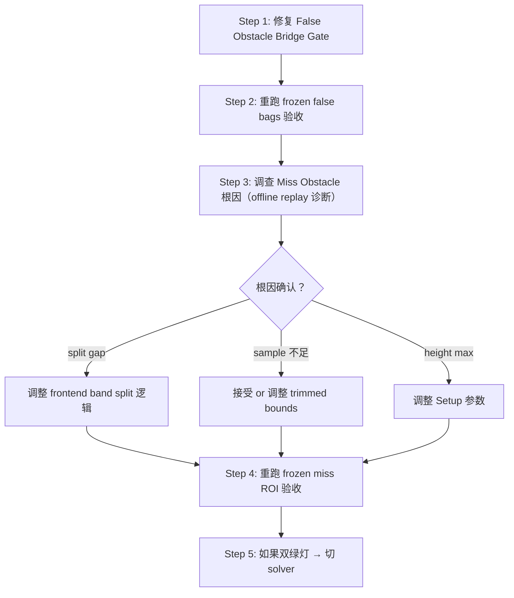

# Phase 4 失败根因分析与修复计划

---

## 问题 1：False Obstacle 回潮（ClearanceDriven, 楼梯 bags）

### 根因分析

`rosbag2_b1_upstairs`（104/156）和 `rosbag2_open_short_upstairs`（39/120）的 false obstacle 根因相同：

**楼梯上方台阶的几何投影同时产生了 overhead_height 和低 clearance。**

在楼梯上行时：
- Cell 的 `support_height` = 当前台阶面
- Cell 的 `overhead_height` = 上方台阶面（由 `OverheadCandidate` 或原有 `overhead_height` 写入）
- `clearance = overhead_height - support_height` ≈ 台阶高差（通常 0.15 ~ 0.25m）
- `min_clearance = 0.5`（YAML 配置）
- 因此 `clearance < min_clearance` → reasoner 标记 `kLowClearance`

Phase 3b 的 bridge 逻辑：

```cpp
// HasLowClearanceObstaclePointBridge
return (reason == kLowClearance || reason == kMixed) &&
       layers.overhead_evidence[index] >= obstacle_points_min_evidence;
```

在楼梯 bag 中 `overhead_evidence` 经过多帧累积可以超过 0.4，bridge 就满足条件 → 发布 obstacle points → **false obstacle**。

### 核心矛盾

| 场景 | `clearance < min_clearance` | 与地面的关系 | 是否应发布 obstacle point |
|------|:---:|---|:---:|
| 真正低天花板 | ✅ | overhead 是结构性天花板，与地面无连续阶梯关系 | ✅ |
| 楼梯上方台阶 | ✅ | overhead 就是下一级台阶，与 support 存在阶梯连续性 | ❌ |

关键区分信号：**在楼梯场景下，同一个 cell 的 `protrusion_evidence` 通常也是非零的**，因为上方台阶同时构成垂直跨度（protrusion candidate）。而真正的低天花板场景中，地面是平的，cell 不会有显著的 protrusion evidence。

### 修复方案

在 `HasLowClearanceObstaclePointBridge` 中增加两个约束：

```cpp
bool HasLowClearanceObstaclePointBridge(const TerrainLayers &layers,
                                        const FrameOutput &output, int cell,
                                        const Config &config) {
  const auto index = static_cast<size_t>(cell);
  if (index >= output.block_reason.size() ||
      index >= layers.overhead_evidence.size()) {
    return false;
  }
  const uint8_t reason = output.block_reason[index];

  // Gate 1: Only pure kLowClearance qualifies.
  // kMixed means protrusion + clearance coexist — this is the staircase
  // pattern. Let the legacy protrusion path handle obstacle point publishing.
  if (reason != static_cast<uint8_t>(BlockReason::kLowClearance)) {
    return false;
  }

  // Gate 2: Suppress bridge if the cell has non-trivial protrusion evidence.
  // On staircases, the upper step creates both overhead and protrusion
  // evidence simultaneously. A pure low-ceiling cell should have
  // near-zero protrusion evidence.
  const float protrusion_evidence =
      index < layers.protrusion_evidence.size()
          ? layers.protrusion_evidence[index]
          : 0.0f;
  if (protrusion_evidence > 0.05f) {
    return false;
  }

  return layers.overhead_evidence[index] >= config.obstacle_points_min_evidence;
}
```

> [!IMPORTANT]
> **Gate 1**（排除 `kMixed`）是最关键的：按 reasoner 定义，`kMixed = protrusion_blocking && low_clearance`，这正是楼梯的典型特征。即使 protrusion path 也在同时运转，让 protrusion 路径自己通过 `obstacle_evidence` 决定是否发布 obstacle points 就够了。
>
> **Gate 2**（protrusion evidence 共存抑制）是防御层：覆盖 protrusion_evidence 积累中但还没 cross blocking 阈值的过渡帧。阈值 `0.05f` 可以用 frozen bags 调优。

### 验证

```bash
# 验证修复后 false obstacle 回潮消除
ros2 run passable_area offline_replay --analyze-false-obstacles \
  --bag /home/deep/deeprobotics/bags/offline_bags/rosbag2_b1_upstairs
ros2 run passable_area offline_replay --analyze-false-obstacles \
  --bag /home/deep/deeprobotics/bags/offline_bags/rosbag2_open_short_upstairs

# 验证仍然保留真正低天花板的 obstacle point（现有测试）
colcon test --packages-select passable_area --event-handlers console_direct+
# 应通过 LowClearanceReasonerBridgePublishesOverheadObstaclePoints
```

新增测试：`StaircaseDoesNotTriggerLowClearanceObstaclePointBridge` — 构造同一 cell 同时有 protrusion_evidence 和 overhead_evidence 的场景，验证 bridge 不触发。

---

## 问题 2：Miss Obstacle EvidenceTooLow（Setup A/B 楼梯侧板）

### 根因分析

验收窗口内（3~4 帧），`max_obstacle_evidence` 只达到 0.08 ~ 0.32，远低于 `obstacle_points_min_evidence = 0.4`。

根据配置：
- `obstacle_evidence_gain = 0.25`（[config_types.hpp L38](file:///home/deep/deeprobotics/passable_humble_ws/src/passable_area/include/passable_area/core/types/config_types.hpp#L38)）
- 理论上 4 帧 × 0.25 × evidence × gain_scale = 最多 ~1.0（如果 evidence=1.0, gain_scale=1.0）

但实际只有 0.08 ~ 0.32，**说明大部分帧根本没有为侧板 cell 生成 protrusion candidate**。

可能原因（按优先级排列）：

| # | 假设 | 机制 | 验证方法 |
|---|------|------|----------|
| 1 | `profile_split_gap = 0.10` 对侧板太宽 | 侧板垂直跨度 ~0.15-0.25m，与 split gap 0.10m 之间的余量很小。如果两层 z 值间距恰好 ≈ split gap，band split 可能不稳定（有时 split、有时不 split） | 用 offline replay + debug 输出查看侧板 cell 的 band split 结果 |
| 2 | 侧板 cell 的 sample 数量太少 | 侧板宽度只有 ~0.2m（2 个 cell at 0.05m resolution × 4 cell），如果单 cell 只有 1~2 个 sample，trimmed bounds 可能退化 | 查看 `filtered_sample_count` |
| 3 | 侧板方向与 `map_height_max = 0.5` 冲突 | `map_height_max` 用于裁剪 z > 0.5 的点，侧板可能部分高于 0.5m（该配置对 miss 场景特制） | 检查 `raw_sample_max_z` vs 0.5 |
| 4 | `NoObstacleSourceSamplesInRoi`（Setup B 右侧 1 帧） | 强 evidence cell 存在但没有当前帧 sample → 上一帧建立了 evidence，但当前帧该 cell 没有新点 | 这是正常的帧间 sample 分布波动 |

### 调查步骤（不改代码）

先通过 offline replay 获取诊断数据，确认根因后再改代码：

```bash
# 查看 Setup A 内哪些 cell 有 protrusion candidate
ros2 run passable_area offline_replay --mode per-frame-dump \
  --bag /home/deep/deeprobotics/bags/test_result/rosbag2_open_up_down_stairs \
  --params-file config/passable_area_map_height_max_0p5.yaml \
  --start-offset 6.7 --time-window 0.4
```

> [!WARNING]
> 在确认根因之前，**不应调整 `obstacle_evidence_gain` 或 `obstacle_points_min_evidence`**。这些参数影响全局行为，盲目调整可能导致 false obstacle 恶化。

### 可能的修复方向（待调查确认后选择）

- **如果根因是 profile_split_gap 过宽**：可以针对侧板这类窄垂直结构降低 split gap 要求，或者在 single tall band 场景下确保 evidence 更高
- **如果根因是 sample 数量不足**：这是结构性的（侧板太窄 + 观测角度），可能需要调整 trimmed bounds 分位数或接受一定的 miss 率
- **如果根因是 map_height_max 裁剪**：这是 Setup 参数问题，不需要改代码

---

## 执行优先级



**建议先做 Step 1**：修复 bridge gate 是代码改动最小、风险最低、验证最快的。改完后 false obstacle bags 应该归零。

**Step 3 不改代码**，只做诊断。等拿到侧板 cell 的 band split / sample count / evidence 数据后再决定是否需要调整 frontend 逻辑。
