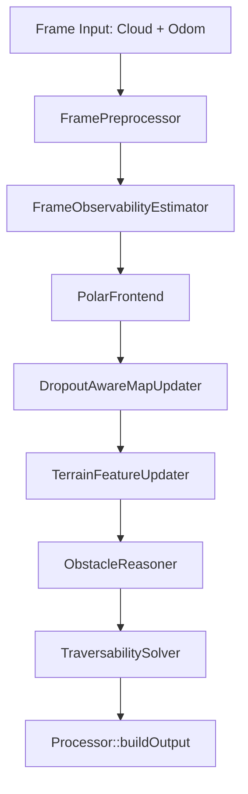

# Passable Area V2 架构完全指南

## 1. 前言：核心目标与 V2 设计哲学

`passable_area` 的定位不是长期的大范围全局建图，而是一个**高频、局部、短时稳定**的地形可通行判定系统。它的目标是告诉机器人当前的“脚下及脚边区域”地形长什么样？可以走吗？有没有障碍物挡路？

**V2 方案重构的核心精神：从“经验补丁”走向“物理第一性原理”。**
- 过去（V1）依赖于诸多补丁逻辑（比如：找不到地面支撑？去借一下邻居的；这是墙还是噪声？写死一套极其复杂的判断树）。
- 现在（V2）依靠统一的**连续性物理证据（Evidence）**和机器人的**物理跨越能力（max_step_up）**来定性，逻辑全链路解耦且高度可解释。

---

## 2. 系统输入、坐标系与输出合同

### 2.1 输入与坐标系
系统在 ROS 侧强依赖于两个严格时间同步（ExactTime）的话题：
- **点云**：`/LOC_BODY_POINTS` (Sensor Message)
- **位姿**：`/ODOM` (Odometry Message)

核心算法中会涉及三个主要坐标系概念：
- **Map (局部栅格坐标)**：算法维护的一个基于里程计的局部动态追踪地图，随着机器人平移。网格内的信息通过历史累积与衰减来保持记忆。
- **Base Gravity (基座重力系)**：仅保留航向角（yaw），过滤掉 pitch/roll。这个坐标系对于剔除因车体倾斜导致的“把斜坡当地面，或把地面当墙”的误判至关重要。
- **Base Link (机器人本体)**：真实的车体坐标系，通常用来剔除车体自身的点云（Body Filter）。

### 2.2 最终输出
- **不可通行代价与状态图**：给规划算法看的栅格地图（`/terrain_state`、`/terrain_cost` 等）。
- **地形调试/障碍点云 (红点)**：给人类开发者或外部视觉模块看的点云（`/terrain_obstacle_points`）。我们在 RViz 中最关注的红点墙就是它发出的。

---

## 3. 全局管线：一帧数据是如何流转的？

V2 的主链路是一个非常清晰的瀑布流。所有逻辑都在 [Processor::update](file:///home/deep/deeprobotics/passable_humble_ws/src/passable_area/src/core/processor.cpp#L116) 中被依次调用。



---

## 4. 链路拆解详解

### 4.1 预处理 (`FramePreprocessor`)
**作用**：清洗点云。
**核心逻辑**：将输入点云转换到 map 坐标系，并通过三维 voxel grid 进行降采样。如果是车体内部的点，会使用 Body Filter 给过滤掉，避免把自己的大腿识别成障碍物。

### 4.2 覆盖观测计算 (`FrameObservabilityEstimator`)
**作用**：判断雷达目前“看”得好不好。
**核心逻辑**：将机器人周围划分成多个环形扇区。依据每个扇区内有效打在地面的点数，判定这个扇区是 `kObserved`（观察充分）、`kPartial`（观察不足）还是发生了盲区/遮挡（如车尾 `Dropout`）。这直接影响后续特征的信任度和衰减速度。

### 4.3 极坐标前端提取 (`PolarFrontend`)
**作用**：负责**粗筛**，从海量点云中提取出当前帧潜在的“地形高程”与“可疑障碍”。
- **文件链接**：[PolarFrontend.cpp](file:///home/deep/deeprobotics/passable_humble_ws/src/passable_area/src/core/polar_frontend.cpp)

**核心逻辑 - 高程切片（Bands）**：
`PolarFrontend` 会对每个 grid cell 内的点云按照高度进行聚类切片，分成几段（Bands）：
1. **support_band**：最下面连续的一段，认为是“脚基”（支撑底座）。
2. **upper_band**：悬在空中的段，可能是台阶上层、悬空的树枝、或者是墙的顶部。

**核心逻辑 - 证据发现（Evidence Generation）**：
前端只负责发现两种物理嫌疑（Suspicious Candidate），并基于高度将它们**百分比化（归一化）归为 0.0 ~ 1.0 的证据**，提供给地图层进行时序融合积累：
1. **Protrusion Candidate (地面突起/墙面)**：
   如果是普通突起，其判定依据为`vertical_span > max_step_up * 0.75`，表明这个东西长得很高了。
   证据打分：`evidence = 突起高度 / max_step_up` （以物理跨越能力作为基准）。
2. **Overhead Candidate (悬空低净空)**：
   有底层基础，且其头部也有物体，但二者空隙太小（低于 `min_clearance`）。
   证据打分：同样基于 `min_clearance` 与 `max_step_up` 归一化。

### 4.4 历史地图汇聚 (`DropoutAwareMapUpdater` & `FeatureUpdater`)
**作用**：基于前端提供的证据更新“带记忆的地图”。
- `MapUpdater` 会用指数滑动平均等方式更新这个格子过去几帧看到的 evidence 强度和地面高度。如果雷达丢包（Dropout），它会暂停快速衰减。
- `TerrainFeatureUpdater` 计算融合后的坡度（Slope）、粗糙度（Roughness）和跨越台阶高度（Step Up/Down）。

### 4.5 障碍推理机 (`ObstacleReasoner`) —— **【V2 的绝对核心大脑】**
**作用**：综合当前 cell 的历史证据和物理几何特征，给出**唯一的结论 (Block Reason)**：到底通不通？如果不通，是因为什么挡住了？
- **文件链接**：[ObstacleReasoner.cpp](file:///home/deep/deeprobotics/passable_humble_ws/src/passable_area/src/core/obstacle_reasoner.cpp#L9)

在旧版本中，各模块互踢皮球，结论模糊。V2 中，`ObstacleReasoner` 拥有**唯一的定性裁决权**，判断规则被重构成基于纯物理能力：

```cpp
bool protrusion_evidence_high = protrusion_evidence >= 0.4f;
// 墙壁判定：必须结合连续性和物理高度限制
bool tall_protrusion = (protrusion_height - support_height) > max_step_up; 
bool protrusion_blocking = protrusion_evidence > 0.4f && (continuity < 0.3f || tall_protrusion);

// 阻挡原因分流树
if (low_clearance && protrusion_blocking) {
    reason = BlockReason::kMixed; // 又低矮又有台阶突起
} else if (low_clearance) {
    reason = BlockReason::kLowClearance; // 如踏面、悬空桌子
} else if (protrusion_blocking) {
    reason = BlockReason::kProtrusion; // 墙壁、台阶立柱、杂物
} else if (geometry_failure) {
    reason = BlockReason::kGeometryFailure; // 太陡的坡、太粗糙的路面
}
```
**亮点重点**：
- **物理优先，防墙分裂**：即便雷达打到了一面极其平滑的墙，系统依然通过 `tall_protrusion` (该凸起高度远超机器人的 `max_step_up`，即跨越极限) 强制锁定它为一堵永远不可能涉足的墙（`kProtrusion`），而不是把它当成台阶（`kLowClearance`）压抑掉。

`Reasoner` 诊断出了 `block_reason`，还会顺带给出在这个格子要不要向外部发布点云（`publish_status`）。

### 4.6 通行性判定器 (`TraversabilitySolver`)
**作用**：基于 `Reasoner` 判定的阻挡原因，颁发“通行证”及计算出路径代价。
- **文件链接**：[TraversabilitySolver.cpp](file:///home/deep/deeprobotics/passable_humble_ws/src/passable_area/src/core/traversability_solver.cpp#L18)

**最高优先级是未知的盲区保护**：如果这个地方被判定为很久没观察到、或者雷达覆盖置信度低，直接返回 `UNKNOWN`，Cost 置空(-1)。
**信任 Reasoner 的一票否决**：
```cpp
if (IsBlockingReason(block_reason)) {
    state = PassabilityState::kImpassable;  // Cost = 100
} else {
    state = PassabilityState::kPassable;    // 计算 1~99 的动态代价
}
```
这里去掉了冗余的阈值检查，彻底完成了算法流图上的**单向信任**。

### 4.7 数据组装与发布 (`Processor::buildOutput`)
**作用**：把内部分析的所有变量打包进统一的 `FrameOutput`。
在这个环节还会执行最后一个重要任务 —— **筛选并发布障碍物点云 (Obstacle Points)**，用于在 RViz 等可视化工具中显示。

- **障碍点云的发布受到严格的条件控制**，必须通过两道门控锁：
  1. **证据锁**: 它的基础属性必须通过 `HasObstaclePointPublishEvidence` 判定（比如确实是 protrusion 且 > 0.4 ，或者满足近场密集源保护 `DenseProtrusionSource`）。
  2. **绝对安全下限锁**：`point_in_base_gravity.z >= -config.geometry.max_step_down + ...`。这把锁防止把楼梯底下的地面、或极深的坑误报为实体障碍点云（“防悬崖误墙”保护）。详见代码：[Processor::PassesObstaclePointPublishHeightGates](file:///home/deep/deeprobotics/passable_humble_ws/src/passable_area/src/core/processor.cpp#L28)。

---

## 5. 诊断与排障指南 (Troubleshooting Checklists)

如果在调试过程中遇到障碍物漏报或持续产生虚假障碍物，请按照以下生命周期顺序排查问题：

1. **(Frontend) 地基不稳，没提取上来**
   去查 `protrusion_evidence` 到底有没有被激发？如果连这个数据都很低，说明前端切片阶段、或采集雷达的角度发生了病态几何缺失。
2. **(Map) 滑动积累被遗忘**
   可能 `obstacle_evidence` 因为机器人的快速旋转，未能形成多帧验证即遭遇快速衰减？检查 Dropout 配置。
3. **(Reasoner) 阻挡类型被归错**
   它被归为了 `kLowClearance` 还是 `kGeometryFailure`？检查 `max_step_up` 设置是否吻合真实机器狗的越障能力。如果不符合，机器狗的认知将会与你期望的脱轨。
4. **(Processor) 发布门控被高低压制**
   RViz 中未能看到障碍物点云，但底层数据显示该格子为 `IMPASSABLE`。这说明它被判定为几何失败（如太陡）或台阶踏面的保守过滤，又或者是距离机器人脚底板太深导致被 `max_step_down` 保护过滤。

**V2 理念一言概之：在物理面前众生平等。让“过不过得去”这一物理事实（高度限制），替代一切繁重复杂的点云模式匹配规则。**
